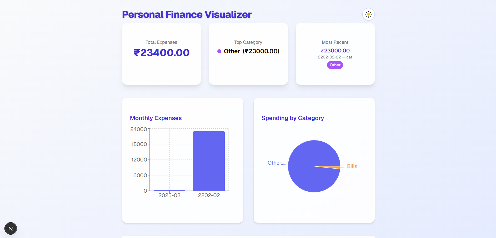

# Personal Finance Visualizer

A modern web application for tracking personal finances, built with Next.js, React, shadcn/ui, Recharts, and MongoDB.

## Features

- **Add, edit, and delete transactions** (amount, date, description, category)
- **Predefined categories** with color-coded badges
- **Monthly expenses bar chart**
- **Category-wise pie chart** with legend
- **Dashboard summary cards** (total expenses, top category, most recent transaction)
- **Responsive, beautiful UI** with light/dark mode toggle
- **Modern UX** using shadcn/ui components and dialogs
- **MongoDB** for persistent storage

## Live(https://personal-finance-visualizer-xi-one.vercel.app/) 

## Screenshots



## Getting Started

### 1. Clone the repository

```bash
git clone <your-repo-url>
cd yard-stick
```

### 2. Install dependencies

```bash
npm install
```

### 3. Set up environment variables

Create a `.env.local` file in the root:

```
MONGODB_URI=your_mongodb_connection_string
```

### 4. Run the development server

```bash
npm run dev
```

Open [http://localhost:3000](http://localhost:3000) in your browser.

---

## Project Structure

- `app/page.tsx` — Main dashboard UI and logic
- `pages/api/transactions.ts` — API routes for CRUD operations (Next.js API)
- `models/Transaction.ts` — Mongoose schema for transactions
- `components/ui/` — shadcn/ui components (Button, Input, Select, Dialog, Card, etc.)

---

## Tech Stack

- **Next.js** (App Router, TypeScript)
- **React 19**
- **shadcn/ui** (Radix UI + Tailwind CSS)
- **Recharts** (charts)
- **MongoDB** (with Mongoose)
- **Tailwind CSS** (utility-first styling)

---

## Scripts

- `npm run dev` — Start development server
- `npm run build` — Build for production
- `npm run start` — Start production server
- `npm run lint` — Lint code

---

## Customization

- Edit categories in `app/page.tsx` (`CATEGORIES` array)
- Change color palette in `CATEGORY_COLORS`
- Add more dashboard cards or charts as needed

---

## Deployment

Deploy easily on [Vercel](https://vercel.com/) or any platform that supports Next.js and environment variables.

---

## License

MIT
